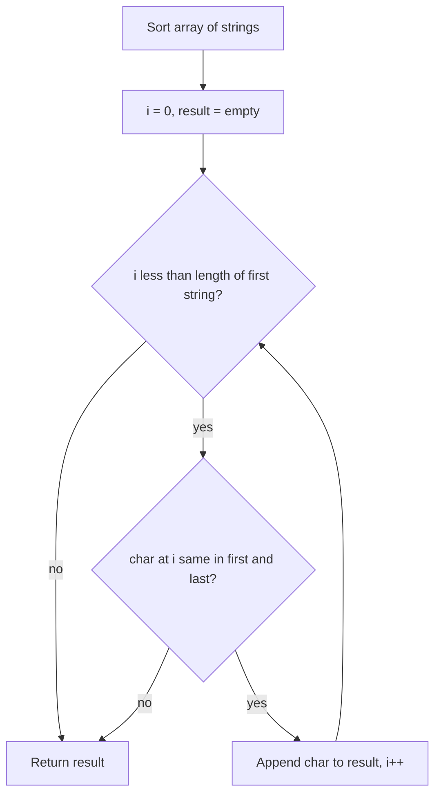

# Longest Common Prefix

## Topic overview

Given several strings, the **longest common prefix** is the longest substring that appears at the **start** of every string.

Example: `["flower", "flow", "flight"]` → common prefix is `"fl"`.

This is a classic string problem. Your solution uses a clever shortcut: **sort the array**, then compare only the **first** and **last** strings character by character. If they match at a position, every string in between (after sorting) must match too at that position.

---

## Problem statement

Given an array of strings `strs`, return the longest common prefix string.

If there is no common prefix, return `""`.

**LeetCode:** [14. Longest Common Prefix](https://leetcode.com/problems/longest-common-prefix/)

---

## Scenarios and edge cases

| Input | Scenario | Output |
|-------|----------|--------|
| `["flower","flow","flight"]` | Normal case | `"fl"` |
| `["dog","racecar","car"]` | No shared prefix | `""` |
| `["a"]` | Single string | `"a"` |
| `["ab", "a"]` | Different lengths | `"a"` |
| `["same","same","same"]` | All identical | `"same"` |
| `["", "b"]` | Empty string in array | `""` |
| `[]` | Empty array (edge) | `""` (guard often needed) |

---

## How it works (step by step)

### Why sorting helps

After **lexicographic sort** (dictionary order):

- `strs[0]` = smallest string
- `strs[length - 1]` = largest string

If **every** string shares a prefix, the smallest and largest must share that same prefix at the start. If first and last differ at index `i`, no string in the array can all agree beyond index `i - 1`.

**Example:** `["flower", "flow", "flight"]`

After sort:

```
["flight", "flow", "flower"]
  ^first              ^last
```

Compare character by character at the same index:

| index | first char | last char | match? | result so far |
|------:|------------|-----------|--------|---------------|
| 0 | f | f | yes | f |
| 1 | l | l | yes | fl |
| 2 | i | w | no | stop |

Return `"fl"`.

**Example with no prefix:** `["dog", "racecar", "car"]`

After sort: `["car", "dog", "racecar"]`

| index | first | last | match? |
|------:|-------|------|--------|
| 0 | c | r | no | stop immediately |

Return `""`.



---

## Approach

### Sort + compare first and last (your method)

```javascript
var longestCommonPrefix = function(strs) {
  strs.sort();
  let i = 0;
  const length = strs.length;
  let result = "";

  while (i < strs[0].length) {
    if (strs[0][i] === strs[length - 1][i]) {
      result += strs[0][i];
    } else {
      break;
    }
    i++;
  }
  return result;
};
```

**Logic:**

1. Sort `strs` alphabetically
2. Walk index `i` from `0` upward
3. If character at `i` matches in first and last string, add it to `result`
4. On first mismatch, `break` and return what you built

---

## Your implementation

In `index.js` you follow this pattern exactly:

- `strs.sort()` — in-place lexicographic sort
- `while (i < strs[0].length)` — stop when first string ends (shortest bound among comparisons with last)
- `strs[0][i] === strs[length - 1][i]` — vertical compare at one index, but only on two strings
- `result += strs[0][i]` — build prefix character by character
- `break` on mismatch — no need to check further indices

**Note:** For an empty `strs` array, `strs[0]` would throw — LeetCode usually gives at least one string, but a guard `if (strs.length === 0) return ""` is good practice.

---

## Other approaches (for learning)

### Vertical scan (compare all strings at each index)

For each index `i`, check if every string has the same character at `i`. Stop at first failure.

- No sort needed
- Time: O(n * m) where n = number of strings, m = length of shortest string

### Horizontal scan (shrink prefix against each string)

Start with `prefix = strs[0]`. For each next string, shorten `prefix` until it is a prefix of that string.

- Time: O(n * m) in typical cases

Your sort approach trades a sort step for comparing only **two** strings instead of all n.

---

## Worked examples

| strs | After sort | Compare first vs last | Output |
|------|------------|------------------------|--------|
| `["flower","flow","flight"]` | flight, flow, flower | f, fl, then mismatch at i=2 | `"fl"` |
| `["dog","racecar","car"]` | car, dog, racecar | mismatch at i=0 | `""` |
| `["a"]` | a | a vs a | `"a"` |
| `["ab","a"]` | a, ab | a vs a at i=0; a vs b at i=1 | `"a"` |

---

## Complexity

Let:

- `n` = number of strings
- `m` = length of the shortest string (or length of common prefix found)

| | Your approach (sort + compare) |
|---|-------------------------------|
| **Time** | **O(n * m log n)** — sort dominates; string comparisons during sort cost up to `m` per compare |
| **Space** | **O(m)** for result string; sort may use extra space depending on engine |

Vertical scan without sort is **O(n * m)** time, **O(1)** extra space (excluding output).

---

## Common mistakes

1. **Comparing without sorting** — Comparing only `strs[0]` and `strs[1]` misses cases where a middle string is the odd one out.
2. **Wrong loop bound** — Use length of **first** string after sort (or min of first and last lengths); comparing past the end of the shorter string causes errors.
3. **Forgetting empty input** — `strs = []` needs a guard before accessing `strs[0]`.
4. **Assuming prefix length** — Common prefix can be shorter than any single string (`["ab","a"]` → `"a"`).
5. **Mutating input** — `strs.sort()` changes the original array order; fine for LeetCode, but copy first if order matters elsewhere.

---

## Practice ideas

1. Rewrite using **vertical scan** (no sort) and compare Big O on paper.
2. Handle `strs.length === 0` and strings that are `""`.
3. Build a **Trie** from all strings and walk until a node has more than one child path — classic follow-up for many prefix problems.
4. Related: LeetCode 208 (Implement Trie), 648 (Replace Words).
