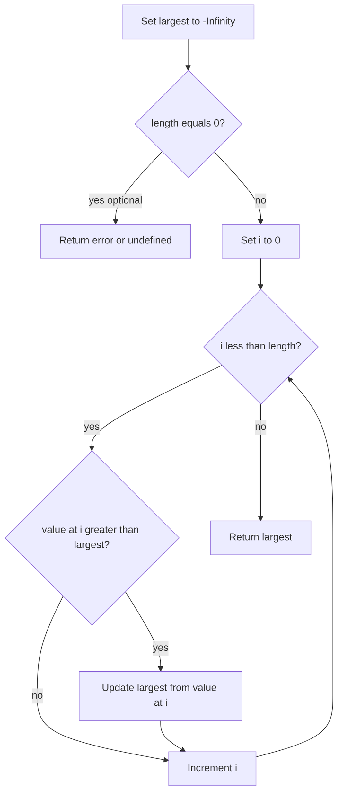

# Find Largest Element in an Array

## Topic overview

Finding the **maximum** value is one of the simplest full-array algorithms: one pass, one variable tracking the best so far. It introduces a critical lesson — **what you initialize `largest` to** decides whether the answer is correct for negatives, positives, or empty input. Your `index.js` shows three stages of the same idea, which is an excellent way to learn.

---

## Problem statement

Given a non-empty array of numbers, return the **largest** (maximum) value.

**Extended:** If the array can be empty, define behavior explicitly (error message, `null`, or throw).

---

## Scenarios and edge cases

| Array | Scenario | Correct max | Pitfall if `largest = 0` |
|-------|----------|-------------|---------------------------|
| `[1, 2, 3, 4, 5]` | All positive | `5` | Works |
| `[-10, -9, -20, -4]` | All negative | `-4` | **Wrong** — stays `0` |
| `[5]` | Single element | `5` | Works |
| `[]` | Empty | undefined / message | Loop never updates `0` |
| `[7, 7, 3]` | Duplicates | `7` | Works |
| Mixed | `[-1, 100, 0]` | `100` | Works if negatives compared correctly |

---

## How it works (step by step)

**Input:** `[-10, -9, -20, -4]` with `largest = -Infinity`

| `i` | `arr[i]` | `largest < arr[i]`? | `largest` after |
|-----|----------|----------------------|-----------------|
| 0 | -10 | yes (-Inf < -10) | -10 |
| 1 | -9 | yes (-10 < -9) | -9 |
| 2 | -20 | no | -9 |
| 3 | -4 | yes (-9 < -4) | **-4** |

Return `-4`.

**Why `-Infinity`?** Any real array number is greater than `-Infinity`, so the first element always becomes the first candidate for max.



---

## Approaches

### 1. Naive initializer: `largest = 0`

```javascript
function findLargestBase(arr) {
  let largest = 0;
  for (let i = 0; i < arr.length; i++) {
    if (largest < arr[i]) {
      largest = arr[i];
    }
  }
  return largest;
}
```

**Works when:** Every value that could win is **greater than 0**, or the array never needs a negative maximum.

**Fails when:** All values are negative — nothing is `> 0`, so you incorrectly return `0`.

Your `arr1 = [1, 2, 3, 4, 5]` fits this case.

---

### 2. Safe for negatives: `largest = -Infinity`

```javascript
function findLargest(arr) {
  let largest = -Infinity;
  for (let i = 0; i < arr.length; i++) {
    if (largest < arr[i]) {
      largest = arr[i];
    }
  }
  return largest;
}
```

**Works when:** Array has at least one element and contains any mix of positive/negative numbers.

Your `arr = [-10, -9, -20, -4]` needs this version.

**Alternative:** Set `largest = arr[0]` and start loop at `i = 1` — also standard and avoids `-Infinity`.

---

### 3. Handle empty array explicitly

```javascript
function findLargestSafe(arr) {
  if (arr.length === 0) {
    return "Array is empty so we cant find the largest number";
    // Or: return null; or throw new Error("Empty array");
  }
  let largest = -Infinity;
  for (let i = 0; i < arr.length; i++) {
    if (largest < arr[i]) {
      largest = arr[i];
    }
  }
  return largest;
}
```

**Works when:** You must not pretend an empty array has a max.

Your `arr2 = []` and `arr3 = [5]` test empty vs single-element cases.

---

### Built-in (awareness)

```javascript
Math.max(...arr);
```

Fine for small arrays in applications. For very large arrays, spread can hit engine limits; the loop stays O(n) with predictable memory.

---

## Your implementation

`index.js` maps cleanly to the three stages:

| Function | Idea |
|----------|------|
| `findLargestNumberBase` | `largest = 0` — teaching the bug for all-negative arrays |
| `findLargestNumberHandleNegative` | `-Infinity` — correct general scan |
| `findLargestNumberOptimized` | Empty check + `-Infinity` — production-style guard |

Console logs demonstrate each scenario — keep that habit when learning edge cases.

---

## Worked examples

| Array | Function style | Result |
|-------|----------------|--------|
| `[-10, -9, -20, -4]` | Negative-safe | `-4` |
| `[1, 2, 3, 4, 5]` | Base (`0` start) | `5` |
| `[5]` | Optimized | `5` |
| `[]` | Optimized | Empty message (your string) |
| `[-10, -9, -20, -4]` | Base (`0` start) | **Incorrect:** `0` |

---

## Complexity

| | Time | Space |
|---|------|-------|
| One-pass max | **O(n)** | **O(1)** |

Every element visited once; only `largest` and index variables stored.

---

## Common mistakes

1. **Starting at `0`** for arrays that can be all negative.
2. **Empty array** — Returning `0` or `-Infinity` without documenting meaning.
3. **Using `>` on wrong operand** — Update when `arr[i] > largest`, equivalent to `largest < arr[i]`.
4. **Assuming sorted array** — Max still needs a full scan unless you know the last element is largest (sorted ascending).
5. **`Math.max` on empty** — `Math.max(...[])` returns `-Infinity` in JavaScript — surprising in APIs.

---

## Practice ideas

1. Write `findSmallest(arr)` with `largest = Infinity` or `arr[0]` pattern.
2. Find max **and its index** in one loop (track both when you update max).
3. Second-largest element (track `max` and `secondMax` with care when duplicates exist).
4. Compare `largest = arr[0]` vs `-Infinity` — when is each clearer?
