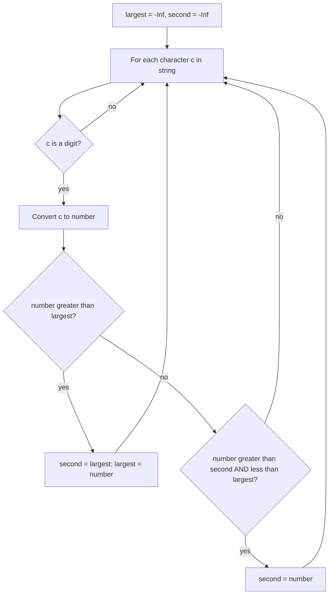

# Second Largest Digit in a String

## Topic overview

This problem combines two skills:

- **Scanning a string** character by character
- Tracking **top two distinct maximum values** in **one pass** (`largest` and `secondLargest`)

It’s the same idea as “second largest in an array”, but here the input is a **string** that may include letters/symbols and digits. We extract digits and compute the second largest **distinct** digit.

---

## Problem statement

Given a string `s`, return the **second largest digit** that appears in `s`.

- Digits are characters `'0'` through `'9'`
- “Second largest” means **strictly less** than the largest digit (distinct)
- If there are fewer than **two distinct digits**, return `-1`

---

## Scenarios and edge cases

| Input string | Digits present | Largest | Second largest | Output |
|--------------|----------------|---------|----------------|--------|
| `"dfa12321afd"` | {1,2,3} | 3 | 2 | 2 |
| `"abc1111"` | {1} | 1 | (none) | -1 |
| `"a0b9c9"` | {0,9} | 9 | 0 | 0 |
| `"xyz"` | {} | (none) | (none) | -1 |
| `"7"` | {7} | 7 | (none) | -1 |
| `"909"` | {0,9} | 9 | 0 | 0 |

---

## How it works (step by step)

We maintain two values:

- `largest`: best (max) digit seen so far
- `secondLargest`: best digit seen so far that is **< `largest`**

Start both at `-Infinity` so negatives never block updates, and the first digit always becomes the first max candidate.

Example: `s = "dfa12321afd"`

Digits encountered in order: `1, 2, 3, 2, 1`

| digit | action | largest | secondLargest |
|------:|--------|--------:|--------------:|
| 1 | new max → shift down | 1 | -∞ |
| 2 | new max → shift down | 2 | 1 |
| 3 | new max → shift down | 3 | 2 |
| 2 | between second and first? no (`2 < 3` but `2` is not `> 2`) | 3 | 2 |
| 1 | ignore | 3 | 2 |

Return `2`.



---

## Approach (one pass)

High-level algorithm:

1. Initialize `largest` and `secondLargest` to `-Infinity`
2. For each character `c` in the string:
   - If it is a digit, convert to a number `num`
   - If `num > largest`: move `largest` to `secondLargest`, set `largest = num`
   - Else if `largest > num > secondLargest`: update `secondLargest = num`
3. If `secondLargest` never changed (still `-Infinity`), return `-1`

---

## Your implementation

In `index.js`, you implement the one-pass approach with:

- `for (let c of s)` to scan characters
- `let num = Number(c)` to convert digit characters into numbers
- The two update rules:
  - New maximum shifts the old maximum into second place
  - Otherwise, update second place only when the number is strictly between
- Final check: `secondLargest === -Infinity ? -1 : secondLargest`

### Important note about digit detection

Your current condition is:

- `if (!isNaN(c)) { ... }`

This works for many LeetCode inputs that contain only letters and digits, but in general JavaScript:

- `!isNaN(' ')` is `true` and `Number(' ')` becomes `0`

So if a string contains spaces, they could be accidentally treated like digit `0`.

Safer digit checks (recommended for notes + future code):

```javascript
// Option A: regex for a single digit character
if (/^[0-9]$/.test(c)) { ... }

// Option B: character range check
if (c >= '0' && c <= '9') { ... }
```

You already have the regex version in your commented-out code — that is the safer approach.

---

## Worked examples

1) `s = "abc1111"` → distinct digits = `{1}` → output `-1`  
2) `s = "a0b9c9"` → distinct digits = `{0,9}` → output `0`  
3) `s = "dfa12321afd"` → distinct digits = `{1,2,3}` → output `2`

---

## Complexity

Let `n = s.length`.

- **Time:** **O(n)** — one pass through the string
- **Space:** **O(1)** — only two numeric variables (no extra arrays/sets)

---

## Common mistakes

1. **Counting duplicates as second largest**: For `"999"`, the answer is `-1` (no second distinct).
2. **Using `>=` in comparisons**: It can break distinctness (duplicates shouldn’t update second largest).
3. **Bad initialization**: Starting with `0` fails when the only digit is `0` and can hide “not found” states.
4. **Loose digit checks**: `!isNaN(c)` can treat whitespace as `0` in JavaScript.

---

## Practice ideas

1. Return the **largest** digit too (return both values).
2. Modify the function to return the **second smallest** digit instead.
3. Solve a version where digits can be more than one character (e.g. `"a12b3"` means numbers 12 and 3) — requires parsing logic, not char-by-char digits.

