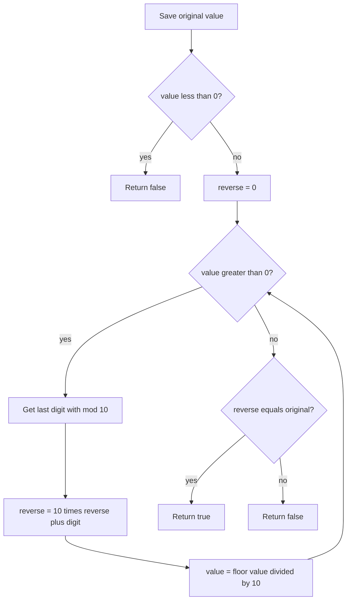

# Palindrome Number

## Topic overview

A **palindrome** reads the same forwards and backwards. For integers, `121` is a palindrome but `123` is not.

This exercise builds directly on [count digits](../7_count_digit/note.md): you already know how to peel off digits with `% 10` and shrink the number with `Math.floor(x / 10)`. Here you **build a reversed number** in a loop and compare it to the original.

---

## Problem statement

Given an integer `x`, return `true` if `x` is a palindrome, otherwise `false`.

**Typical rules (LeetCode-style):**

- Negative numbers → `false` (e.g. `-121` is not considered a palindrome)
- Single digit and `0` → `true`
- Do not convert to string (your code uses math — good for interviews)

---

## Scenarios and edge cases

| Input | Scenario | Reversed | Palindrome? |
|------:|----------|----------|-------------|
| `121` | Odd-length classic | `121` | yes |
| `123` | Not symmetric | `321` | no |
| `0` | Zero | `0` | yes |
| `7` | Single digit | `7` | yes |
| `10` | Ends with 0 (not 0 itself) | `1` | no |
| `1221` | Even length | `1221` | yes |
| `-121` | Negative | — | no |
| `1000021` | Large non-palindrome | different | no |

---

## How it works (step by step)

### Core idea: reverse digits with math

Each loop iteration:

1. Take last digit: `remain = x % 10`
2. Add it to the reversed number: `reverse = 10 * reverse + remain`
3. Remove last digit from `x`: `x = Math.floor(x / 10)`

**Trace for `x = 121`**

Save original: `final = 121`. Loop mutates `x`, so we keep `final` for comparison.

| step | x before | remain | reverse after | x after |
|-----:|---------:|-------:|--------------:|--------:|
| 1 | 121 | 1 | 1 | 12 |
| 2 | 12 | 2 | 12 | 1 |
| 3 | 1 | 1 | 121 | 0 |

Loop stops (`x > 0` is false). Compare: `reverse === final` → `121 === 121` → **true**.

**Trace for `x = 123`**

| step | x | remain | reverse |
|-----:|--:|-------:|--------:|
| 1 | 123 | 3 | 3 |
| 2 | 12 | 2 | 32 |
| 3 | 1 | 1 | 321 |

`321 !== 123` → **false**.

**Trace for `x = 0`**

The `while (x > 0)` loop never runs, so `reverse` stays `0`. Original is `0`. `0 === 0` → **true**.



---

## Approach

### Standard math reversal

```javascript
function isPalindrome(x) {
  if (x < 0) return false;

  const original = x;
  let reverse = 0;

  while (x > 0) {
    const digit = x % 10;
    reverse = 10 * reverse + digit;
    x = Math.floor(x / 10);
  }

  return reverse === original;
}
```

**Why `10 * reverse + digit`?**

- `reverse = 12`, new digit `3` → `12 * 10 + 3 = 123`
- Same as `reverse *= 10` then `reverse += digit` (your `palindrom` version)

---

## Your implementation

You wrote **three versions** in `index.js`:

### `palindrom` and `palindrom2` (same logic, different style)

- Guard: `if (x < 0) return false`
- Save `final = x` before the loop destroys `x`
- Build reverse in the loop
- Compare `reverse === final`

| Version | How reverse grows |
|---------|-------------------|
| `palindrom` | `reverse *= 10` then `reverse + remain` |
| `palindrom2` | `reverse = (10 * reverse) + remain` |

Both are equivalent. Version 2 is the usual interview style (one line per step).

### `palindrom3`

- No negative check — negatives would still reverse and might accidentally match in edge cases; for strict LeetCode rules, add `x < 0` guard
- Uses `xCopy` instead of `final` — same idea
- Returns `reverse === xCopy` directly (cleaner than if/else)

Your tests: `0` → true, `121` → true, `123` → false.

---

## Worked examples

| Input | Reverse built | Result |
|------:|--------------|--------|
| `121` | 121 | true |
| `123` | 321 | false |
| `0` | 0 (loop skipped) | true |
| `10` | 1 | false |
| `-5` | (palindrom / palindrom2 return early) | false |

---

## Complexity

Let `d` = number of digits in `x`.

- **Time:** **O(d)** — one loop iteration per digit
- **Space:** **O(1)** — only a few variables

Same growth as digit counting: proportional to `log10(|x|)` for the numeric value.

---

## Common mistakes

1. **Losing the original** — Loop overwrites `x`; save `final` or `xCopy` first.
2. **Wrong reverse formula** — Adding digit before multiplying: `reverse + remain * 10` builds digits in the wrong order.
3. **Treating negatives as palindromes** — `-121` reversed is `-121` in some naive math, but by definition we return `false`.
4. **Assuming all numbers with repeated digits are palindromes** — `121` yes, `112` no.
5. **String shortcut without understanding** — `String(x) === String(x).split('').reverse().join('')` works but misses the math pattern used in harder problems.

---

## Practice ideas

1. Add the negative guard to `palindrom3` and test `-121`, `-1`.
2. **Palindrome II (string):** check if a string can become a palindrome by removing one character.
3. **Reverse integer overflow:** some problems cap reversed value; know when `reverse` grows too large for 32-bit.
4. Link forward: use the same digit loop for [sum of digits](../7_count_digit/note.md) practice.
