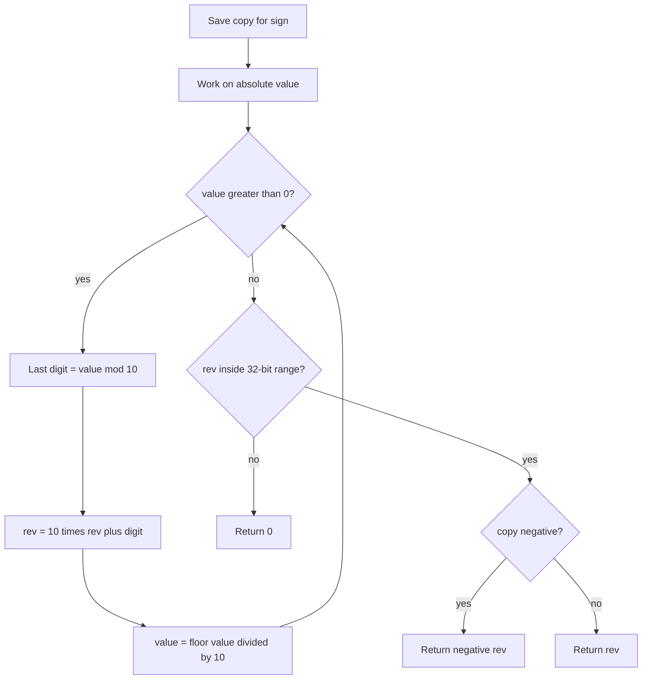

# Reverse Integer (32-bit)

## Topic overview

This is the same **digit-reversal loop** as [palindrome number](../8_palindrom_number/note.md), but instead of comparing, you **return the reversed value** and enforce **32-bit signed integer limits**.

If the reversed value does not fit in a 32-bit `int`, return `0`.

---

## Problem statement

Given a signed 32-bit integer `x`:

1. Reverse the digits of `x`
2. Keep the sign (negative input → negative output)
3. If the reversed value is outside the 32-bit range, return `0`

Examples:

- `123` → `321`
- `-123` → `-321`
- `120` → `21` (leading zeros disappear when built as a number)
- `0` → `0`

---

## 32-bit signed range (must know)

A signed 32-bit integer can store:

- **Minimum:** `-2^31` = `-2147483648`
- **Maximum:** `2^31 - 1` = `2147483647`

Your code uses:

- `limit = 2**31` → `2147483648`
- Overflow if `rev < -limit` OR `rev > limit - 1`

That matches the valid range above.

---

## Scenarios and edge cases

| Input | Reversed (concept) | Fits 32-bit? | Output |
|------:|------------------|--------------|--------|
| `123` | `321` | yes | `321` |
| `-123` | `-321` | yes | `-321` |
| `120` | `21` | yes | `21` |
| `0` | `0` | yes | `0` |
| `1534236469` | `9463524351` | no (too large) | `0` |
| `-2147483648` | edge case | check overflow | `0` or valid per reversal |
| `1463847412` | common LeetCode overflow test | often `0` | `0` |

---

## How it works (step by step)

### Same reversal loop as palindrome

1. Remember sign with `copy = x`
2. Work on `Math.abs(x)` so the loop logic is always the same
3. Each iteration: last digit → append to `rev` → shrink `x`

**Trace for `x = 123`**

| step | x | last | rev |
|-----:|--:|-----:|----:|
| 1 | 123 | 3 | 3 |
| 2 | 12 | 2 | 32 |
| 3 | 1 | 1 | 321 |

Check range → OK. `copy >= 0` → return `321`.

**Trace for `x = -123`**

Same loop on `123` → `rev = 321`. `copy < 0` → return `-321`.

**Trace for `x = 0`**

Loop does not run → `rev = 0` → return `0`.



---

## Approach

### Full solution (matches your structure)

```javascript
var reverse = function(x) {
  let copy = x;
  let rev = 0;
  x = Math.abs(x);

  while (x > 0) {
    let last = x % 10;
    rev = 10 * rev + last;
    x = Math.floor(x / 10);
  }

  const limit = 2 ** 31; // 2147483648
  if (rev < -limit || rev > limit - 1) return 0;

  return copy < 0 ? -rev : rev;
};
```

### Why check overflow after reversing?

Your approach builds the full `rev`, then compares to limits. That is fine in JavaScript for LeetCode-style problems.

In languages with fixed `int` (Java, C++), reversing can overflow **during** the loop. Interviewers often ask you to check **before** each `rev = 10 * rev + last`:

- If `rev > INT_MAX / 10` → overflow soon
- If `rev === INT_MAX / 10` and `last > 7` → next step exceeds max (because max ends in `7`)
- Mirror logic for negative min (ends in `8`)

Worth knowing both styles.

---

## Your implementation

In `index.js`:

- `copy` stores the original sign
- `Math.abs(x)` simplifies the while loop (same pattern as digit counting)
- `rev = (10 * rev) + last` — identical core to `palindrom2`
- `limit = 2**31` with `rev > limit - 1` for max bound
- Ternary at the end restores negative results

Commented `Math.pow(2, 31)` is equivalent to `2**31`; the `**` form is shorter and common in modern JS.

---

## Worked examples

| Input | rev after loop | Range OK? | Output |
|------:|---------------:|-----------|--------|
| `123` | 321 | yes | `321` |
| `-123` | 321 | yes | `-321` |
| `120` | 21 | yes | `21` |
| `0` | 0 | yes | `0` |
| `1534236469` | 9463524351 | no | `0` |

---

## Complexity

Let `d` = number of digits in `|x|`.

- **Time:** **O(d)** — one loop per digit
- **Space:** **O(1)** — only `copy`, `rev`, and loop variables

---

## Common mistakes

1. **Forgetting sign** — Reversing `-123` must yield `-321`, not `321`.
2. **Wrong limits** — Max is `2^31 - 1`, not `2^31`. Your `rev > limit - 1` handles this.
3. **Using string reverse only** — Works in JS but does not teach overflow checks or math reversal.
4. **Not handling `0`** — Should return `0`, not enter wrong branches.
5. **Trailing zeros in input** — `1000` reverses to `1`; that is correct when building a number, not a string with leading zeros.

---

## Practice ideas

1. Rewrite overflow check **inside** the loop (before multiplying `rev` by 10).
2. Combine with [palindrome](../8_palindrom_number/note.md): reverse half the number only (advanced optimization).
3. Test: `1463847412`, `1534236469`, `-2147483412` and confirm `0` when expected.
