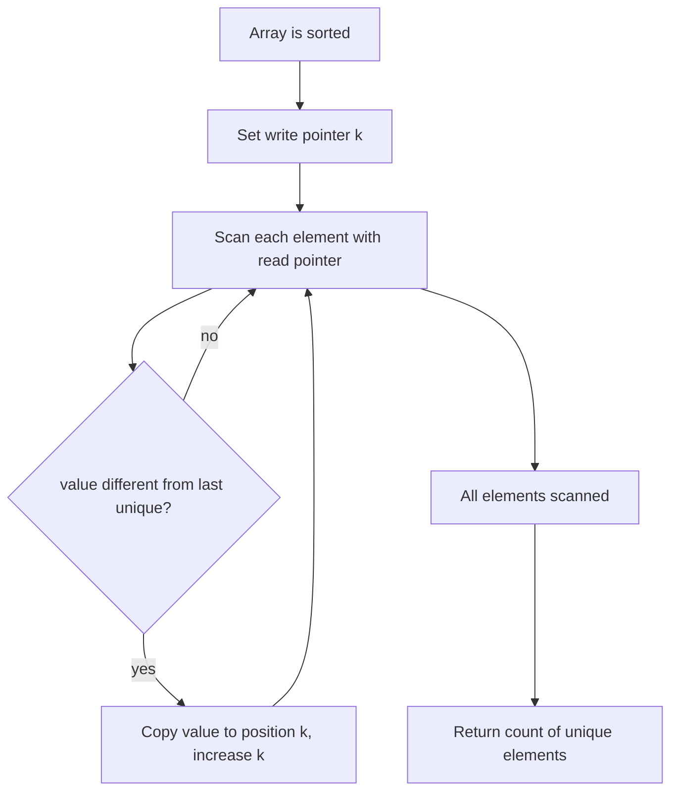

# Remove Duplicates from Sorted Array

## Topic overview

When an array is **already sorted**, duplicate values sit next to each other. You can remove duplicates **in place** without extra arrays by using a **two-pointer** pattern:

- One pointer **scans** every element
- One pointer marks where to **write** the next unique value

This is LeetCode **26. Remove Duplicates from Sorted Array** — a foundation for in-place array problems (move zeroes, remove element, merge sorted arrays).

---

## Problem statement

Given a **sorted** integer array `nums`:

1. Remove duplicates **in place** so each unique value appears only once
2. Return `k` — the number of unique elements
3. The first `k` positions of `nums` must hold those unique values (order preserved)

**Example**

- Input: `nums = [1, 1, 2, 2, 3]`
- After: first `k = 3` cells are `[1, 2, 3, ...]` (rest can be anything)
- Return: `3`

---

## Scenarios and edge cases

| nums | Scenario | k | First k values |
|------|----------|---|----------------|
| `[1, 1, 2, 2, 3]` | Normal | 3 | 1, 2, 3 |
| `[1]` | Single element | 1 | 1 |
| `[1, 1, 1]` | All same | 1 | 1 |
| `[1, 2, 3]` | No duplicates | 3 | 1, 2, 3 |
| `[]` | Empty | 0 | (none) |

**Important:** The array must be sorted. If it is not sorted, this logic is wrong.

---

## How it works (step by step)

### Two-pointer idea

- **`k`** (write index): boundary of “unique region” built so far
- **`j` or `i`** (read index): scans the full array

When the scanner sees a **new** value (different from the last unique), copy it to position `k` and grow `k`.

**Trace — Approach A** on `[1, 1, 2, 2, 3]` (`k` starts at 1, compare with `nums[k-1]`)

| j | nums[j] | nums[k-1] | New unique? | Action | k after | nums (first k) |
|---|---------|-----------|-------------|--------|---------|----------------|
| 1 | 1 | 1 | no | skip | 1 | [1, ...] |
| 2 | 2 | 1 | yes | nums[1]=2 | 2 | [1,2,...] |
| 3 | 2 | 2 | no | skip | 2 | [1,2,...] |
| 4 | 3 | 2 | yes | nums[2]=3 | 3 | [1,2,3] |

Return `k = 3`.

**Trace — Approach B** on same array (`k` starts at 0, use `nums[i] > nums[k]`)

| i | nums[i] | nums[k] | New? | Action | k after |
|---|---------|---------|------|--------|---------|
| 0 | 1 | 1 | no | skip | 0 |
| 1 | 1 | 1 | no | skip | 0 |
| 2 | 2 | 1 | yes | k++, nums[1]=2 | 1 |
| 3 | 2 | 2 | no | skip | 1 |
| 4 | 3 | 2 | yes | k++, nums[2]=3 | 2 |

Return `k + 1 = 3`.



---

## Approach

### Approach A — `k` starts at 1, compare with previous unique

```javascript
var removeDuplicates = function(nums) {
  let k = 1;
  for (let j = 1; j < nums.length; j++) {
    if (nums[j] !== nums[k - 1]) {
      nums[k] = nums[j];
      k++;
    }
  }
  return k;
};
```

- Index `0` is always part of the answer (first unique)
- `k` is the **count** of uniques when the loop ends

### Approach B — `k` starts at 0, use greater-than (sorted only)

```javascript
var removeDuplicates = function(nums) {
  let k = 0;
  for (let i = 0; i < nums.length; i++) {
    if (nums[i] > nums[k]) {
      k++;
      nums[k] = nums[i];
    }
  }
  return k + 1;
};
```

- First element stays at `nums[0]` without copying
- `nums[i] > nums[k]` means “strictly larger than last unique” — works because array is sorted
- Return `k + 1` because `k` is an index, not a count

Both approaches are **O(n)** and **in place**.

---

## Your implementation

`index.js` contains **both** versions under the same name `removeDuplicates`. In JavaScript, the **second function overwrites the first**, so only Approach B runs if you call `removeDuplicates` as written.

For learning, treat them as two solutions:

| | Approach A (first in file) | Approach B (second in file) |
|---|---------------------------|----------------------------|
| Write index start | `k = 1` | `k = 0` |
| Condition | `nums[j] !== nums[k - 1]` | `nums[i] > nums[k]` |
| Return | `k` | `k + 1` |
| Compare style | inequality | greater-than (needs sorted) |

Rename one (e.g. `removeDuplicatesA` / `removeDuplicatesB`) if you want to test both.

---

## Worked examples

| nums (sorted) | Return k | Unique prefix |
|---------------|----------|---------------|
| `[1,1,2,2,3]` | 3 | `[1,2,3]` |
| `[0,0,1,1,1,2,2,3,3,4]` | 5 | `[0,1,2,3,4]` |
| `[1]` | 1 | `[1]` |
| `[2,2,2]` | 1 | `[2]` |

---

## Complexity

Let `n = nums.length`.

- **Time:** **O(n)** — one pass through the array
- **Space:** **O(1)** — only pointers `k` and `j`/`i`; no extra array

---

## Common mistakes

1. **Unsorted array** — Duplicates not adjacent; two-pointer unique logic fails.
2. **Wrong return value** — Approach B returns `k + 1`; Approach A returns `k` directly. Mixing them up is a frequent bug.
3. **Starting `k` wrong** — If `k` starts at 0 in Approach A without handling index 0, you may overwrite incorrectly.
4. **Using `!==` on floats** — Rare here; integers are fine.
5. **Expecting shorter array length** — `nums.length` stays the same; only the first `k` values matter to the judge.

---

## Practice ideas

1. LeetCode **80** — Remove Duplicates II (allow at most two copies).
2. LeetCode **27** — Remove Element (same in-place write-pointer pattern).
3. LeetCode **283** — Move Zeroes (shift non-zeros forward).
4. Return the unique subarray: `nums.slice(0, k)` after your function runs.
