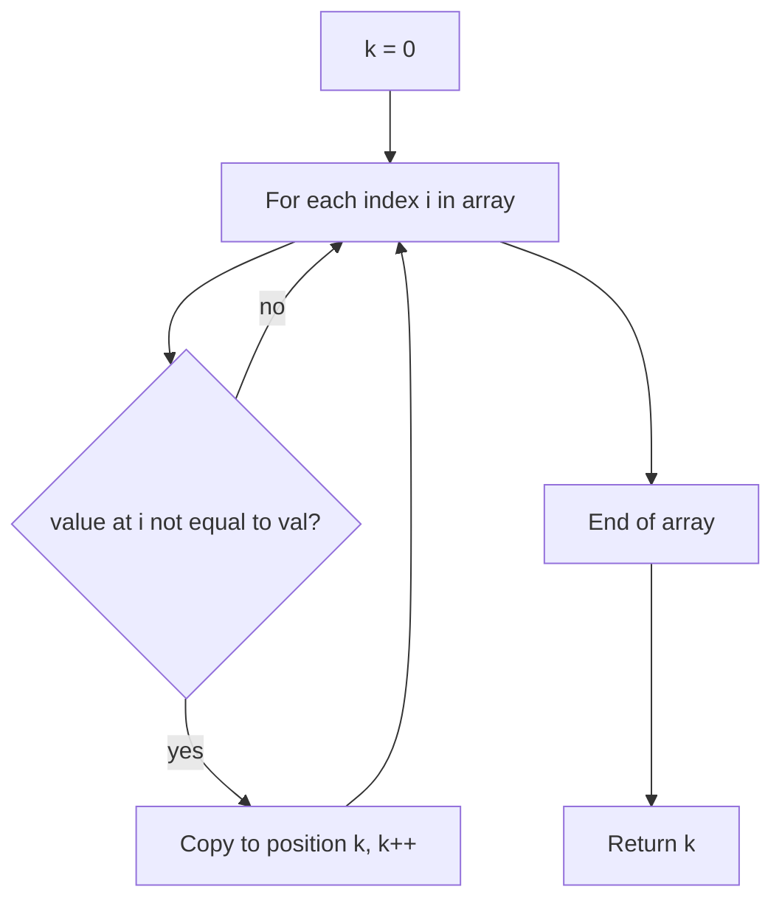

# Remove Element

## Topic overview

This problem uses the same **in-place two-pointer** idea as [remove duplicates](../1_remove_duplicates/note.md), but simpler:

- Keep every element **except** a target value `val`
- Compact the kept values to the front of `nums`
- Return how many were kept

LeetCode **27. Remove Element** — order of remaining elements may change in some solutions; your solution **preserves relative order** of kept elements.

---

## Problem statement

Given an integer array `nums` and an integer `val`:

1. Remove all occurrences of `val` **in place**
2. Return `k` — how many elements remain
3. The first `k` cells of `nums` should be those remaining values (in original order for your approach)

**Example**

- `nums = [3, 2, 2, 3]`, `val = 3`
- After: first `k = 2` values are `[2, 2, ...]`
- Return: `2`

---

## Scenarios and edge cases

| nums | val | k | First k values |
|------|-----|---|----------------|
| `[3,2,2,3]` | 3 | 2 | 2, 2 |
| `[0,1,2,2,3,0,4,2]` | 2 | 5 | 0, 1, 3, 0, 4 |
| `[1]` | 1 | 0 | (empty) |
| `[1,2,3]` | 4 | 3 | 1, 2, 3 |
| `[]` | 0 | 0 | (empty) |
| `[2,2,2]` | 2 | 0 | (empty) |

Unlike remove duplicates, the array **does not** need to be sorted.

---

## How it works (step by step)

### Two pointers

- **`i`** — reads every index from `0` to `length - 1`
- **`k`** — next position to write a kept value (also equals count of kept elements when done)

**Rule:** If `nums[i] !== val`, copy it to `nums[k]` and increment `k`. If it equals `val`, skip (do not advance `k`).

**Trace:** `nums = [3, 2, 2, 3]`, `val = 3`

| i | nums[i] | equals val? | Action | k after | nums (concept) |
|---|---------|-------------|--------|---------|----------------|
| 0 | 3 | yes | skip | 0 | [...] |
| 1 | 2 | no | nums[0]=2, k++ | 1 | [2,...] |
| 2 | 2 | no | nums[1]=2, k++ | 2 | [2,2,...] |
| 3 | 3 | yes | skip | 2 | [2,2,...] |

Return `k = 2`.

**Trace:** `nums = [0,1,2,2,3,0,4,2]`, `val = 2`

Kept values in order: `0, 1, 3, 0, 4` → `k = 5`.



---

## Approach

```javascript
var removeElement = function(nums, val) {
  let k = 0;
  for (let i = 0; i < nums.length; i++) {
    if (nums[i] !== val) {
      nums[k] = nums[i];
      k++;
    }
  }
  return k;
};
```

**Why it works**

- `k` only moves when we keep a value
- Each kept value is written left-to-right, so **order is preserved**
- No extra array — O(1) extra space

---

## Your implementation

Your `index.js` matches the standard solution exactly:

- `k = 0` as write pointer
- Single loop with `i`
- `!== val` before copy
- Return `k` as the count

Clean and interview-ready.

---

## Compare with remove duplicates

| | Remove duplicates | Remove element |
|---|-------------------|----------------|
| Array must be sorted? | yes | no |
| What to skip | duplicate of previous unique | equals `val` |
| Condition | `nums[j] !== nums[k-1]` or `nums[i] > nums[k]` | `nums[i] !== val` |
| Pattern | two-pointer compact | two-pointer compact |

Same skeleton: **read with `i`, write with `k`**.

---

## Worked examples

| nums | val | Return k | First k elements |
|------|-----|----------|------------------|
| `[3,2,2,3]` | 3 | 2 | 2, 2 |
| `[0,1,2,2,3,0,4,2]` | 2 | 5 | 0, 1, 3, 0, 4 |
| `[1]` | 1 | 0 | — |
| `[4,5]` | 4 | 1 | 5 |

---

## Complexity

Let `n = nums.length`.

- **Time:** **O(n)** — one pass
- **Space:** **O(1)** — only `k` and `i`

---

## Common mistakes

1. **Incrementing `k` when skipping** — Only `k++` after writing a kept value.
2. **Returning `k - 1`** — `k` is already the count after the loop.
3. **Using `==` instead of `!==`** — Prefer strict inequality for clarity.
4. **Expecting shorter `nums.length`** — Length unchanged; judge only checks first `k` entries.
5. **Confusing with remove duplicates** — Here you compare to a fixed `val`, not to the previous element.

---

## Practice ideas

1. LeetCode **283** — Move Zeroes (treat `0` as `val` or swap variant).
2. LeetCode **26** — [Remove duplicates](../1_remove_duplicates/note.md) if not done yet.
3. Two-pointer from ends: swap non-`val` toward front (order not preserved, fewer writes when `val` is rare).
4. Count how many `val` were removed: `nums.length - k`.
