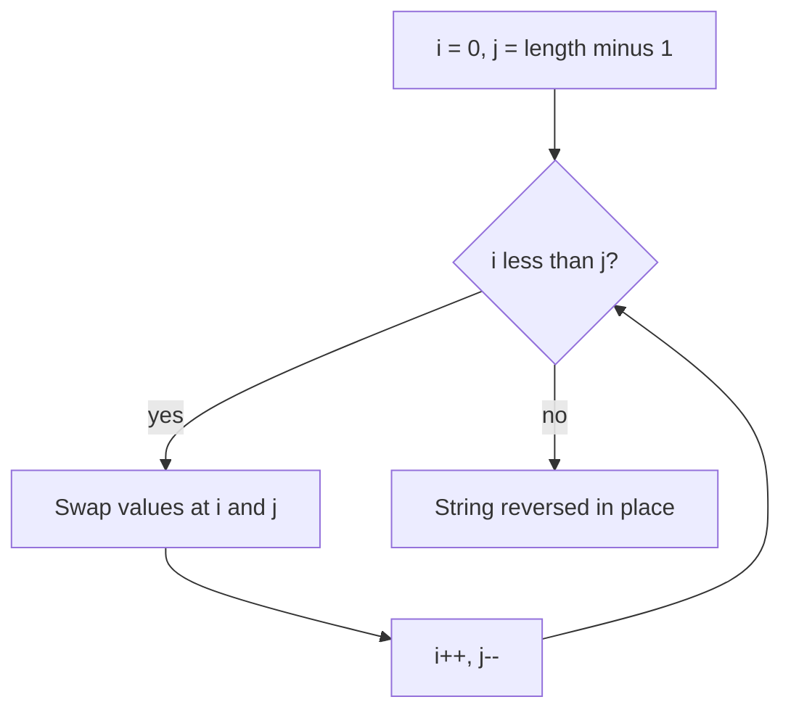

# Reverse String (In Place)

## Topic overview

Reversing a string **in place** means swapping characters from both ends toward the middle — no new array required. This uses the **two-pointer** pattern again (like [remove element](../2_remove_element/note.md)), but here both pointers move inward and **swap** values.

LeetCode **344. Reverse String** — input is an array of characters `s`; modify `s` directly.

---

## Problem statement

Given a character array `s`, reverse it **in place**.

**Example**

- Input: `['h','e','l','l','o']`
- Output (in place): `['o','l','l','e','h']`

The function should mutate `s`; returning `s` is optional (your code returns it for convenience).

---

## Scenarios and edge cases

| s | length | Swaps needed | Result |
|---|--------|--------------|--------|
| `['h','e','l','l','o']` | 5 | 2 (middle stays) | reversed hello |
| `['H','a','n','n','a','h']` | 6 | 3 | reversed |
| `['a']` | 1 | 0 | `['a']` |
| `[]` | 0 | 0 | `[]` |
| `['a','b']` | 2 | 1 | `['b','a']` |

For odd length, the **middle character** is never swapped (it stays in place).

---

## How it works (step by step)

### Core idea: mirror swaps

Pair up:

- left index `i` starting at `0`
- right index `j` starting at `length - 1`

Swap `s[i]` and `s[j]`, then move `i` right and `j` left. Stop when they meet or cross.

**Trace — Approach 1** on `['h','e','l','l','o']`

| step | i | j | swap | s after |
|-----:|--:|--:|------|---------|
| start | 0 | 4 | — | h e l l o |
| 1 | 0 | 4 | h ↔ o | o e l l h |
| 2 | 1 | 3 | e ↔ l | o l l e h |
| 3 | — | — | i < j false (i=2, j=2) | done |

Middle `l` at index 2 untouched — correct for odd length.

**Trace — Approach 2** on `['a','b','c','d']` (length 4, `n = 2`)

Loop `i = 0` to `n - 1`, partner index = `len - 1 - i`:

| i | partner | swap |
|---|---------|------|
| 0 | 3 | a ↔ d |
| 1 | 2 | b ↔ c |

Result: `['d','c','b','a']`.



---

## Approach

### Approach 1 — two pointers (while)

```javascript
var reverseString = function(s) {
  let i = 0;
  let j = s.length - 1;
  while (i < j) {
    [s[i], s[j]] = [s[j], s[i]];
    i++;
    j--;
  }
};
```

- Stop when `i >= j` (middle not swapped twice)
- ES6 destructuring swaps without a temp variable

### Approach 2 — for loop over first half

```javascript
var reverseString = function(s) {
  let n = Math.floor(s.length / 2);
  let len = s.length;
  for (let i = 0; i < n; i++) {
    let temp = s[i];
    s[i] = s[len - 1 - i];
    s[len - 1 - i] = temp;
  }
};
```

- `n = floor(length / 2)` = number of swap pairs
- Partner index: `len - 1 - i` (mirror of `i`)

Both are equivalent and correct.

---

## Your implementation

`index.js` has both versions named `reverseString` — the **second overwrites the first** in JavaScript. For testing both, rename them (e.g. `reverseStringTwoPointer` / `reverseStringForLoop`).

| | Approach 1 | Approach 2 |
|---|------------|------------|
| Control | `while (i < j)` | `for (i < n)` |
| Swap | destructuring | `temp` variable |
| Stops when | pointers meet | half the array processed |

You `return s` — fine for local runs; LeetCode only needs in-place mutation.

---

## Worked examples

| Input s | After reverse |
|---------|----------------|
| `['h','e','l','l','o']` | `['o','l','l','e','h']` |
| `['a','b']` | `['b','a']` |
| `['a']` | `['a']` |
| `[]` | `[]` |

---

## Complexity

Let `n = s.length`.

- **Time:** **O(n)** — each element involved in at most one swap; about `n / 2` swaps
- **Space:** **O(1)** — only indices and maybe one `temp`; no extra array

---

## Common mistakes

1. **Loop too far** — Swapping past the middle reverses twice (wrong). Use `i < j` or only `i < n/2`.
2. **Wrong partner index** — Should be `len - 1 - i`, not `len - i`.
3. **Off-by-one on `j` initial value** — Must start at `length - 1`, not `length`.
4. **Creating a new array** — Problem asks in-place; `s.reverse()` works in JS but learn the two-pointer pattern for interviews.
5. **Even vs odd length** — Odd: middle index `i === j` should not swap again; `while (i < j)` handles this automatically.

---

## Practice ideas

1. LeetCode **344** / **151** — reverse words in a string (harder, still two-pointer or split).
2. [Palindrome check](../../../warm_up/8_palindrom_number/note.md) — same inward pointers, but compare instead of swap.
3. Reverse only vowels in a string (LeetCode 345).
4. Reverse a **linked list** — same idea, different data structure.
