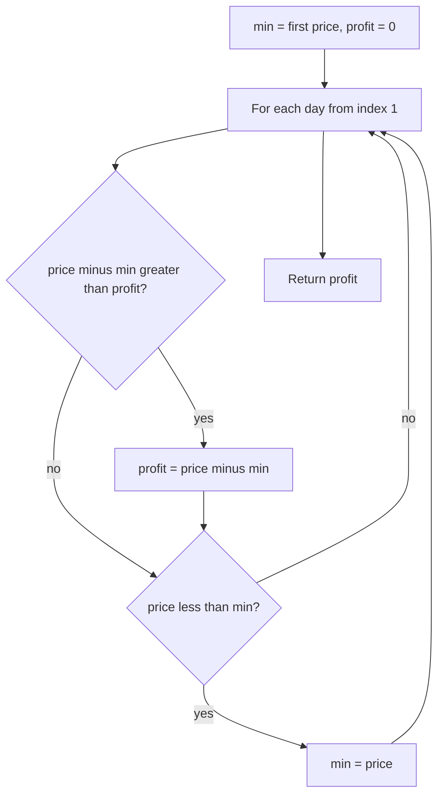

# Best Time to Buy and Sell Stock

## Topic overview

You are given daily stock prices. You may **buy once** and **sell once** (sell must be on a **later** day). Goal: maximize profit.

The efficient idea is not to try every pair of days (that would be O(n²)). In one pass, track:

- **`min`** — cheapest price seen so far (best buy day so far)
- **`profit`** — best profit if you sell today using that cheapest past buy

LeetCode **121. Best Time to Buy and Sell Stock**.

---

## Problem statement

Given an array `prices` where `prices[i]` is the stock price on day `i`:

- Pick one day to **buy** and a **later** day to **sell**
- Return the **maximum profit**
- If no profit is possible, return `0`

**Example**

- `prices = [7, 1, 5, 3, 6, 4]`
- Buy at `1` (day 1), sell at `6` (day 4) → profit `5`

---

## Scenarios and edge cases

| prices | Scenario | max profit |
|--------|----------|------------|
| `[7, 1, 5, 3, 6, 4]` | Classic | 5 |
| `[7, 6, 4, 3, 1]` | Only goes down | 0 |
| `[1, 2]` | Simple rise | 1 |
| `[2, 4, 1]` | New low after rise | 2 (buy 2, sell 4) |
| `[5]` | One day | 0 |
| `[]` | Empty | 0 (guard in real code) |

**Rules**

- You must sell **after** you buy (later index)
- Profit = `sell price - buy price`, never negative in the answer (return 0 minimum)

---

## How it works (step by step)

### One-pass: track min price and best profit

For each day `i` (from day 1 onward):

1. **Try selling today:** profit if bought at cheapest day so far = `prices[i] - min`
2. If that beats `profit`, update `profit`
3. **Update cheapest buy:** if `prices[i] < min`, set `min = prices[i]`

**Trace:** `[7, 1, 5, 3, 6, 4]`

Start: `min = 7`, `profit = 0`

| i | price | sell profit (price - min) | profit after | min after |
|---|------:|--------------------------:|-------------:|----------:|
| 1 | 1 | 1 - 7 = -6 | 0 | 1 |
| 2 | 5 | 5 - 1 = 4 | 4 | 1 |
| 3 | 3 | 3 - 1 = 2 | 4 | 1 |
| 4 | 6 | 6 - 1 = 5 | 5 | 1 |
| 5 | 4 | 4 - 1 = 3 | 5 | 1 |

Return `5`.

**Why update profit before updating min?**

At day `i`, `min` should be the lowest price on days **before** `i` when you compute “sell today.” Your loop order does that: compare with current `min`, then let today’s price become the new `min` for future days.



---

## Approach

```javascript
var maxProfit = function(prices) {
  let min = prices[0];
  let profit = 0;
  for (let i = 1; i < prices.length; i++) {
    if (prices[i] - min > profit) {
      profit = prices[i] - min;
    }
    if (prices[i] < min) {
      min = prices[i];
    }
  }
  return profit;
};
```

**Alternative (same idea, one line per day):**

```javascript
profit = Math.max(profit, prices[i] - min);
min = Math.min(min, prices[i]);
```

---

## Your implementation

Your `index.js` matches the standard optimal solution:

- `min` starts at `prices[0]`
- Loop from `i = 1`
- Update `profit` when `prices[i] - min` is larger
- Update `min` when a new low appears

No nested loops — single scan.

**Edge note:** If `prices` can be empty, add `if (!prices.length) return 0` before using `prices[0]`. LeetCode usually gives at least one day.

---

## Brute force (why one pass is better)

Try every buy day `i` and every sell day `j > i`:

- Time: **O(n²)**
- Your approach: **O(n)**

The one-pass method is the pattern interviewers want.

---

## Worked examples

| prices | Best buy | Best sell | Profit |
|--------|----------|-----------|--------|
| `[7,1,5,3,6,4]` | 1 | 6 | 5 |
| `[7,6,4,3,1]` | — | — | 0 |
| `[1,2]` | 1 | 2 | 1 |
| `[2,4,1]` | 2 | 4 | 2 |

---

## Complexity

Let `n = prices.length`.

- **Time:** **O(n)** — one loop
- **Space:** **O(1)** — only `min` and `profit`

---

## Common mistakes

1. **Updating `min` before computing profit** — Can allow “buy and sell same day” or wrong pairing; keep “sell today vs past min” first.
2. **Nested loops** — Correct but slow; learn the one-pass version.
3. **Allowing sell before buy** — Only loop forward from `i = 1` with `min` from earlier days.
4. **Returning negative profit** — Use `0` when prices only fall; your `profit` starts at `0` and only increases when `prices[i] - min > profit`.
5. **Confusing with “unlimited transactions”** — That is LeetCode **122** (different problem).

---

## Practice ideas

1. LeetCode **122** — Best Time to Buy and Sell Stock II (many trades).
2. LeetCode **123** / **188** — limited number of transactions.
3. Track **which days** gave max profit (store buy/sell indices).
4. Related pattern: “running minimum” appears in many array problems.
