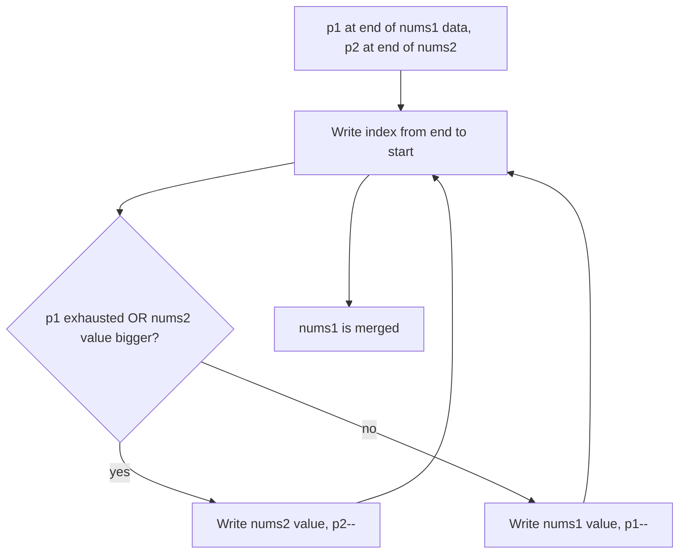

# Merge Sorted Array (In Place)

## Topic overview

Merging two sorted arrays is a core DSA skill. The twist in this problem is that `nums1` already has extra space at the end, so you must write the merged result **into `nums1`**.

This is LeetCode **88. Merge Sorted Array**.

Your file shows two good approaches:

- **Optimal in-place from the end** (O(1) extra space)
- **Copy-first-half then merge forward** (easier to think about, O(m) extra space)

---

## Problem statement

You are given:

- `nums1` of length `m + n`, where the first `m` elements are sorted and valid, and the last `n` elements are placeholders (often zeros)
- `nums2` of length `n`, sorted

Merge `nums2` into `nums1` so that `nums1` becomes a single sorted array.

You must modify `nums1` in place.

**Example**

- `nums1 = [1,2,3,0,0,0], m = 3`
- `nums2 = [2,5,6], n = 3`
- After merge: `nums1 = [1,2,2,3,5,6]`

---

## Scenarios and edge cases

| nums1 (m+n) | m | nums2 | n | Result |
|-------------|---|-------|---|--------|
| `[1,2,3,0,0,0]` | 3 | `[2,5,6]` | 3 | `[1,2,2,3,5,6]` |
| `[1]` | 1 | `[]` | 0 | `[1]` |
| `[0]` | 0 | `[1]` | 1 | `[1]` |
| `[2,0]` | 1 | `[1]` | 1 | `[1,2]` |
| `[4,5,6,0,0,0]` | 3 | `[1,2,3]` | 3 | `[1,2,3,4,5,6]` |
| `[1,2,2,0,0,0]` | 3 | `[2,2,3]` | 3 | `[1,2,2,2,2,3]` |

Important:

- The placeholders at the end of `nums1` are **not part of the sorted data**.
- `m` and `n` tell you which parts are valid.

---

## How it works (step by step)

### Best idea: fill from the end (avoid overwriting)

If you try to write the merged output from the start of `nums1`, you may overwrite values from `nums1` that you still need to compare later.

But if you write from the **end**, you always place the **largest remaining** value into the next free slot.

Pointers:

- `p1 = m - 1` points to last valid element in `nums1`
- `p2 = n - 1` points to last element in `nums2`
- `i` goes from `m + n - 1` down to `0` (write position)

**Example trace**

`nums1 = [1,2,3,0,0,0]`, `m=3`  
`nums2 = [2,5,6]`, `n=3`

Start: `p1=2 (3)`, `p2=2 (6)`

| i | nums1[p1] | nums2[p2] | choose | nums1 after (suffix) | p1 | p2 |
|---|-----------|-----------|--------|----------------------|----|----|
| 5 | 3 | 6 | 6 | `... 6` | 2 | 1 |
| 4 | 3 | 5 | 5 | `... 5 6` | 2 | 0 |
| 3 | 3 | 2 | 3 | `... 3 5 6` | 1 | 0 |
| 2 | 2 | 2 | 2 from nums1 | `... 2 3 5 6` | 0 | 0 |
| 1 | 1 | 2 | 2 | `... 1 2 2 3 5 6` | 0 | -1 |
| 0 | 1 | — | 1 | `1 2 2 3 5 6` | -1 | -1 |

Now merged.



---

## Approach 1 (optimal): in-place from the end

This is your first `merge` function:

```javascript
var merge = function(nums1, m, nums2, n) {
  let p1 = m - 1;
  let p2 = n - 1;

  for (let i = nums1.length - 1; i >= 0; i--) {
    if (p1 < 0 || (p2 >= 0 && nums1[p1] < nums2[p2])) {
      nums1[i] = nums2[p2];
      p2--;
    } else {
      nums1[i] = nums1[p1];
      p1--;
    }
  }
};
```

Why the condition works:

- If `p1 < 0`, `nums1` has no remaining valid elements → must take from `nums2`
- Otherwise, compare last elements and place the larger one at the current end position

---

## Approach 2 (simpler to reason): copy then merge forward

This is your second `merge` function:

```javascript
var merge = function(nums1, m, nums2, n) {
  let copy = nums1.slice(0, m);
  let i = 0;
  let j = 0;

  for (let k = 0; k < nums1.length; k++) {
    if (j >= n || (i < m && copy[i] <= nums2[j])) {
      nums1[k] = copy[i];
      i++;
    } else {
      nums1[k] = nums2[j];
      j++;
    }
  }
  return nums1;
};
```

Idea:

- Copy the valid part of `nums1` (`m` items)
- Now merge `copy` and `nums2` into `nums1` from left to right

This avoids overwrite issues because the original `nums1` values are safely stored in `copy`.

---

## Your implementation

You defined `merge` twice in the same file. In JavaScript, the **second definition overwrites the first**, so only the copy-based approach will run if you call `merge`.

For learning/testing both, rename them:

- `mergeInPlaceFromEnd`
- `mergeUsingCopy`

---

## Worked examples

1) `nums1=[1,2,3,0,0,0], m=3, nums2=[2,5,6], n=3` → `[1,2,2,3,5,6]`  
2) `nums1=[0], m=0, nums2=[1], n=1` → `[1]`  
3) `nums1=[2,0], m=1, nums2=[1], n=1` → `[1,2]`\n
---

## Complexity

Let `m` and `n` be the counts of valid elements in `nums1` and `nums2`.

- **Approach 1 (from end):** Time **O(m + n)**, Space **O(1)**
- **Approach 2 (copy):** Time **O(m + n)**, Space **O(m)** (copy array)

---

## Common mistakes

1. **Merging from the start without a copy** — overwrites `nums1` values you still need.
2. **Using `nums1.length` as `m`** — remember only first `m` values are valid.
3. **Forgetting edge cases**:
   - `m = 0` (nums1 has no valid numbers)
   - `n = 0` (nums2 empty)
4. **Not handling pointer exhaustion** — once one pointer is done, take remaining from the other.
5. **Confusing stable order** — both approaches preserve sorted order; stability across equal values depends on `<` vs `<=` choices.

---

## Practice ideas

1. Merge two sorted arrays into a **new** array (simpler, uses extra space).
2. Merge **k sorted arrays** (use a min-heap) — advanced.
3. Related problems:
   - LeetCode 21 (Merge Two Sorted Lists)
   - LeetCode 977 (Squares of a Sorted Array)

