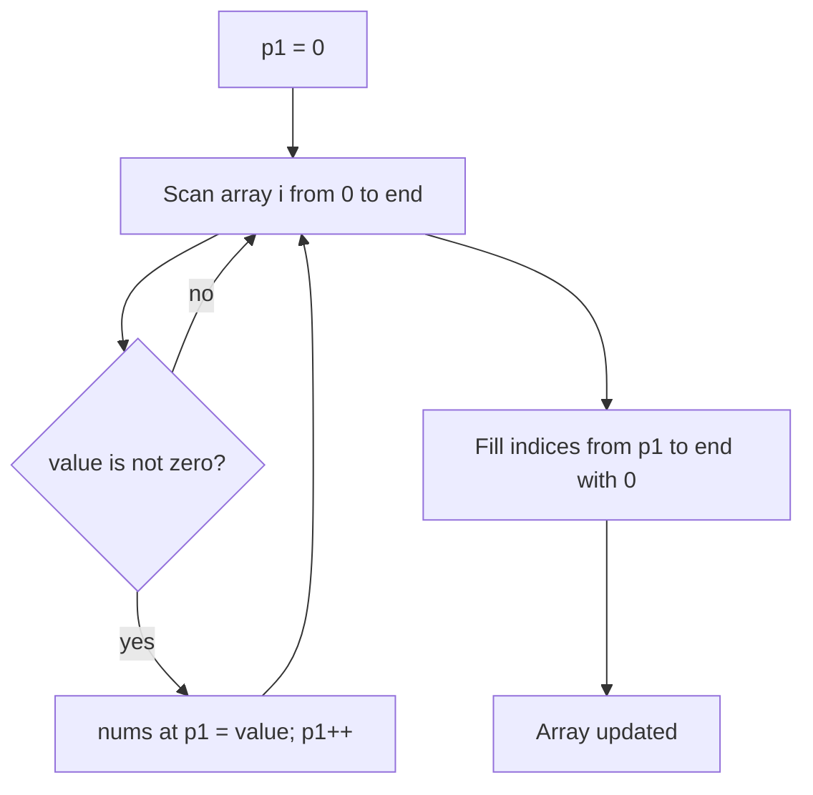

# Move Zeroes (In Place)

## Topic overview

This problem is a direct extension of the **write-pointer compaction** pattern you used in:

- [Remove element](../2_remove_element/note.md) (skip a target value)
- Remove duplicates (skip duplicates in a sorted array)

Here the target value is `0`, and the rule is:

- Keep all **non-zero** numbers in the same relative order
- Move all zeros to the **end**
- Do everything **in place**

LeetCode **283. Move Zeroes**.

---

## Problem statement

Given an integer array `nums`, move all `0`s to the end while maintaining the relative order of the non-zero elements.

Modify `nums` in place. Do not return anything.

**Example**

- Input: `[0, 1, 0, 3, 12]`
- Output (in place): `[1, 3, 12, 0, 0]`

---

## Scenarios and edge cases

| nums | Scenario | Result |
|------|----------|--------|
| `[0,1,0,3,12]` | Normal mix | `[1,3,12,0,0]` |
| `[1,2,3]` | No zeros | `[1,2,3]` |
| `[0,0,0]` | All zeros | `[0,0,0]` |
| `[0]` | Single element | `[0]` |
| `[]` | Empty | `[]` |
| `[1,0,0,2,0,3]` | Many zeros | `[1,2,3,0,0,0]` |

---

## How it works (step by step)

Your solution uses **two passes**:

1. **First pass:** copy all non-zero values forward using a write pointer `p1`
2. **Second pass:** fill the rest of the array with zeros

### Pass 1: compact non-zeros

`p1` = index where the next non-zero should be written.

**Trace** for `nums = [0, 1, 0, 3, 12]`:

Start: `p1 = 0`

| i | nums[i] | non-zero? | write to nums[p1] | p1 after | nums (concept) |
|---|--------:|----------:|-------------------|---------:|----------------|
| 0 | 0 | no | — | 0 | [0,1,0,3,12] |
| 1 | 1 | yes | nums[0]=1 | 1 | [1,1,0,3,12] |
| 2 | 0 | no | — | 1 | [1,1,0,3,12] |
| 3 | 3 | yes | nums[1]=3 | 2 | [1,3,0,3,12] |
| 4 | 12 | yes | nums[2]=12 | 3 | [1,3,12,3,12] |

After pass 1, the first `p1` positions are the non-zero values in order:

- non-zero prefix: `[1, 3, 12]`
- `p1 = 3` means “next write would happen at index 3”

### Pass 2: fill zeros

Fill from index `p1` to end with `0`:

- indices `3` and `4` become `0`
- final result: `[1, 3, 12, 0, 0]`



---

## Approach (your code)

```javascript
var moveZeroes = function(nums) {
  let p1 = 0;

  // pass 1: move non-zeros forward
  for (let i = 0; i < nums.length; i++) {
    if (nums[i] !== 0) {
      nums[p1] = nums[i];
      p1++;
    }
  }

  // pass 2: fill rest with zeros
  for (let i = p1; i < nums.length; i++) {
    nums[i] = 0;
  }
};
```

**Why two passes?**

- Pass 1 guarantees the correct order of non-zeros
- Pass 2 restores the required number of zeros at the end

---

## Worked examples

| Input | Output |
|-------|--------|
| `[0, 1, 0, 3, 12]` | `[1, 3, 12, 0, 0]` |
| `[1, 2, 3]` | `[1, 2, 3]` |
| `[0, 0]` | `[0, 0]` |
| `[1, 0, 2, 0, 3]` | `[1, 2, 3, 0, 0]` |

---

## Complexity

Let `n = nums.length`.

- **Time:** **O(n)** (two passes is `2n`, still O(n))
- **Space:** **O(1)** extra space

---

## Common mistakes

1. **Breaking order** by swapping zeros with non-zeros from the end (some solutions allow it, but this problem requires stable order).
2. **Forgetting the second pass** — after compaction, the tail may contain old values.
3. **Incrementing `p1` incorrectly** — only increment when you write a non-zero.
4. **Treating `"0"` as 0** — ensure you are working with numbers.

---

## Practice ideas

1. Solve with a **single pass + swaps** (still stable if done carefully, but more writes).
2. Modify to move all occurrences of a given value `val` to the end (generalize from `0`).
3. Related problems:
   - LeetCode 27 (Remove Element) — same write-pointer idea
   - LeetCode 26 (Remove Duplicates) — another in-place compaction

