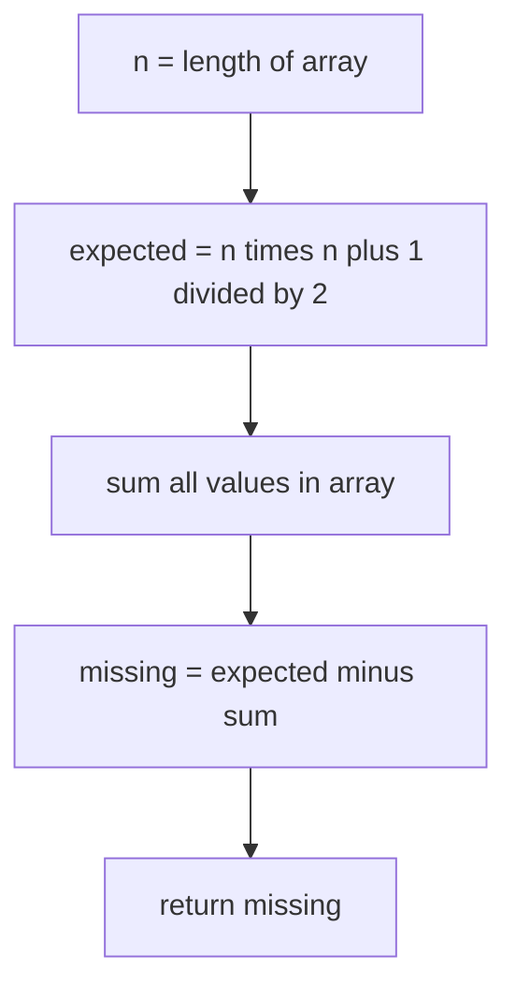

# Missing Number

## Topic overview

This problem is a clean use of a **math formula + one pass**.

If the array contains `n` distinct numbers taken from the range `0..n`, exactly **one number is missing**. Instead of searching, we compare:

- the **expected sum** of `0..n`
- the **actual sum** of the array

Their difference is the missing value.

LeetCode **268. Missing Number**.

---

## Problem statement

Given an array `nums` containing `n` distinct numbers in the range `[0, n]`, return the one number that is missing from the array.

Examples:

- `nums = [3,0,1]` → missing `2`
- `nums = [0,1]` → missing `2`
- `nums = [9,6,4,2,3,5,7,0,1]` → missing `8`

---

## Scenarios and edge cases

| nums | n | Missing | Why |
|------|---|---------|-----|
| `[3,0,1]` | 3 | 2 | range should be 0..3 |
| `[0,1]` | 2 | 2 | range 0..2 |
| `[1]` | 1 | 0 | range 0..1, 0 missing |
| `[0]` | 1 | 1 | range 0..1, 1 missing |
| `[]` | 0 | 0 | range 0..0 |

Important:

- Array is **not guaranteed sorted**
- Values are distinct
- Exactly one missing value

---

## How it works (step by step)

### 1) Expected sum of 0..n

Sum of first `n` natural numbers (including 0) is:

`sumOfN = n * (n + 1) / 2`

Example: `n = 3` → `0+1+2+3 = 6` and formula gives `3*4/2 = 6`.

### 2) Actual sum of array

Compute:

`sumOfCurr = nums[0] + nums[1] + ... + nums[n-1]`

### 3) Missing number

`missing = sumOfN - sumOfCurr`

**Trace** for `nums = [3,0,1]`

- `n = 3`
- `sumOfN = 3 * 4 / 2 = 6`
- `sumOfCurr = 3 + 0 + 1 = 4`
- `missing = 6 - 4 = 2`



---

## Approach (your code)

```javascript
var missingNumber = function(nums) {
  let n = nums.length;
  let sumOfN = (n * (n + 1)) / 2;
  let sumOfCurr = 0;

  for (let i = 0; i < n; i++) {
    sumOfCurr += nums[i];
  }

  return sumOfN - sumOfCurr;
};
```

---

## Your implementation

Your `index.js` implements the standard sum-difference solution:

- `n = nums.length`
- compute expected sum using `n * (n + 1) / 2`
- compute current sum in a single loop
- return difference

This is one of the cleanest solutions for this problem.

---

## Worked examples

| nums | expected sum | actual sum | missing |
|------|--------------|------------|---------|
| `[3,0,1]` | 6 | 4 | 2 |
| `[0,1]` | 3 | 1 | 2 |
| `[1]` | 1 | 1 | 0 |
| `[0]` | 1 | 0 | 1 |
| `[]` | 0 | 0 | 0 |

---

## Complexity

Let `n = nums.length`.

- **Time:** **O(n)** — one loop to sum values
- **Space:** **O(1)** — a few variables

---

## Common mistakes

1. **Using wrong formula** — make sure you use `n * (n + 1) / 2` for range `0..n` (not `1..n` only).
2. **Integer overflow (in other languages)** — in Java/C++ large `n` can overflow 32-bit when computing `n*(n+1)`; use 64-bit.
3. **Assuming sorted array** — no need to sort; sorting makes it O(n log n).
4. **More than one missing or duplicates** — this method assumes exactly one missing and all numbers distinct.

---

## Practice ideas

1. Solve using XOR (also O(n), avoids sum overflow): `missing = 0 ^ 1 ^ ... ^ n ^ nums[0] ^ ...`.
2. If there are duplicates and one missing, use cyclic sort / index marking (different problem).
3. Related: find missing number in 1..n (no zero) — adjust the sum formula.

