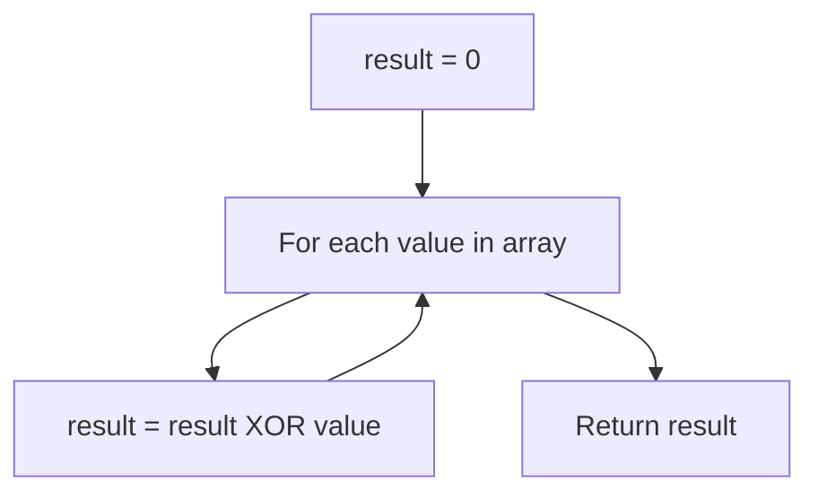

# Single Number

## Topic overview

This is the classic “every element appears twice except one” problem.

There are two common solutions:

1. **Hash map counting** — easy to understand, uses extra space
2. **Bitwise XOR** — very efficient, O(1) space, interview favorite

LeetCode **136. Single Number**.

---

## Problem statement

Given a non-empty array of integers `nums`, every element appears **exactly twice** except for one element which appears **once**. Find that single element.

Examples:

- `[2,2,1]` → `1`
- `[4,1,2,1,2]` → `4`
- `[1]` → `1`

---

## Scenarios and edge cases

| nums | Single number |
|------|---------------|
| `[2,2,1]` | 1 |
| `[4,1,2,1,2]` | 4 |
| `[1]` | 1 |
| `[-1, -1, -7]` | -7 |

Assumptions (important):

- Exactly one number appears once
- All others appear exactly twice

If the input violates this (e.g. numbers appear 3 times), the XOR trick will not work as-is.

---

## How it works (step by step)

### Approach 1: counting with a hash map

Count each number’s frequency, then return the one with count 1.

Trace for `[4,1,2,1,2]`:

Counts become:

- 4 → 1
- 1 → 2
- 2 → 2

Return 4.

### Approach 2: XOR trick (the key insight)

XOR properties:

- `a ^ a = 0` (a number XOR itself cancels out)
- `a ^ 0 = a`
- XOR is commutative and associative: order doesn’t matter

So if every number appears twice except one:

`(a ^ a) ^ (b ^ b) ^ (c) = 0 ^ 0 ^ c = c`

**Trace for `[4,1,2,1,2]`:**

Start `result = 0`

| step | num | result after (`result ^= num`) |
|-----:|----:|-------------------------------:|
| 1 | 4 | 0 ^ 4 = 4 |
| 2 | 1 | 4 ^ 1 |
| 3 | 2 | (4 ^ 1) ^ 2 |
| 4 | 1 | ((4 ^ 1) ^ 2) ^ 1 = 4 ^ (1 ^ 1) ^ 2 = 4 ^ 0 ^ 2 |
| 5 | 2 | (4 ^ 2) ^ 2 = 4 ^ (2 ^ 2) = 4 |

Final answer: `4`.



---

## Approach(es)

### Approach 1: hash map frequency

```javascript
var singleNumber = function(nums) {
  let hash = {};
  for (let i = 0; i < nums.length; i++) {
    if (!hash[nums[i]]) {
      hash[nums[i]] = 1;
    } else {
      hash[nums[i]]++;
    }
  }
  for (let i = 0; i < nums.length; i++) {
    if (hash[nums[i]] === 1) {
      return nums[i];
    }
  }
};
```

Note: in JavaScript, object keys become strings. For this problem it’s OK, but `Map` is cleaner for general use.

### Approach 2: XOR (optimal)

```javascript
var singleNumber = function(nums) {
  let result = 0;
  for (let i = 0; i < nums.length; i++) {
    result ^= nums[i];
  }
  return result;
};
```

---

## Your implementation

Your file includes both solutions as `singleNumber`.

- The **1st approach** builds a `hash` object, counts occurrences, then scans again to return the number with count 1.
- The **2nd approach** uses XOR and returns `result`.

In JavaScript, the **second function overwrites the first**, so the XOR approach is the one that actually runs if you call `singleNumber` as written.

---

## Worked examples

| nums | Output |
|------|--------|
| `[2,2,1]` | 1 |
| `[4,1,2,1,2]` | 4 |
| `[1]` | 1 |

---

## Complexity

Let `n = nums.length`.

| Approach | Time | Space |
|----------|------|-------|
| Hash map | O(n) | O(n) |
| XOR | O(n) | O(1) |

---

## Common mistakes

1. **Using XOR when counts aren’t exactly 2** — XOR only works for “pairs cancel” situations.
2. **Forgetting JS bitwise limits** — Bitwise operators in JS use 32-bit signed integers internally. LeetCode inputs for this problem fit fine, but be aware for very large numbers.
3. **Object key pitfalls** in hash approach — for general coding, prefer `Map` to avoid edge cases with inherited keys.
4. **Returning early during counting** — you need full counts before deciding.

---

## Practice ideas

1. LeetCode **137** — Single Number II (every element appears 3 times except one).
2. LeetCode **260** — Single Number III (two unique numbers).
3. Implement the hash approach using `Map` and compare code clarity.

